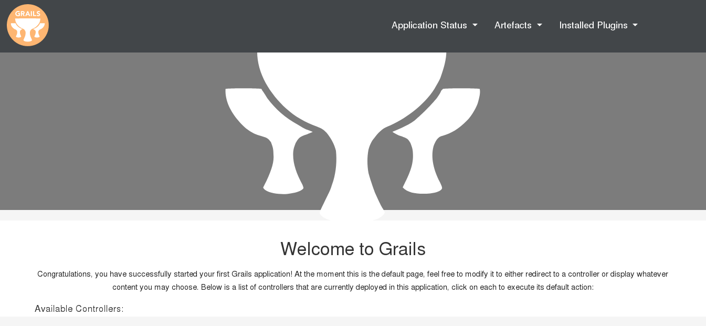

# Grails Quickstart
> A simple auto-generated Grails app


## Sample




## Purpose

This project is a simple Grails-baseed web-app.

This doesn't do much so just serves as a reference for myself on how a Grails app is setup.

I didn't change any code from the auto-generated quickstarted - I just added docs.


## How to create a Grails scaffold

This project was created with Grails Application Forge service.

- http://start.grails.org/

The service lets you download a zip file with the Generate button or a curl command (using your app name). The default settings were used - a web app, though you can choose React, REST API, etc. The latest Grails version was used.

```sh
$ curl -O start.grails.org/grailsQuickstart.zip -d version=4.0.3
```

The app was nammed `grailsQuickstart` so the name `grailsquickstart` now appears in part of the code.

For a more detailed guide, see [Creating your first Grails app](https://guides.grails.org/creating-your-first-grails-app/guide/index.html) in the Grails docs.


## Requirements

- [Java](https://java.com)
- [Groovy](https://groovy-lang.org)
- [Grails](https://grails.org)


## Installation

### System dependencies

Install Grails.

Recommended - install using _SDKMAN!_ approach and then Grails through the `sdk` command. See the Grails [Download](https://grails.org/download.html) page for full details.


Check it installed globally.

```sh
$ grails -version
```


## Usage

### Run application

Run the Grails - this will resolve dependencies and configure the application.

```sh
$ grails
```

Enter `run-app`.

Open in the browser:

- http://localhost:8080


### Run tests

```sh
$ bash gradlew clean check
```

Sample output:

```
BUILD SUCCESSFUL in 7s
8 actionable tasks: 7 executed, 1 up-to-date
```
